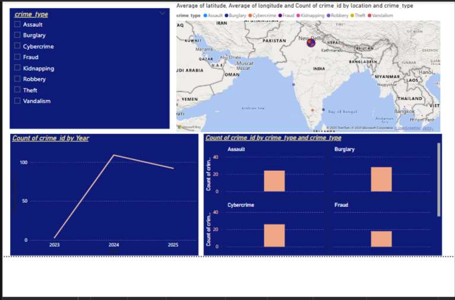
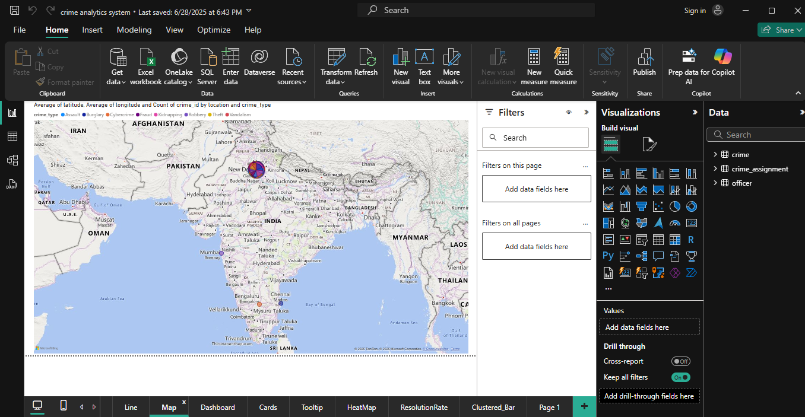
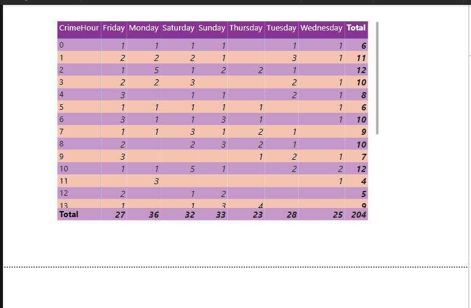
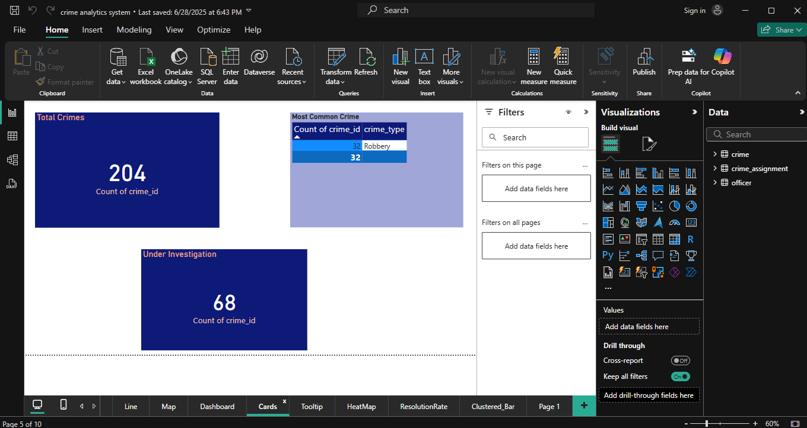
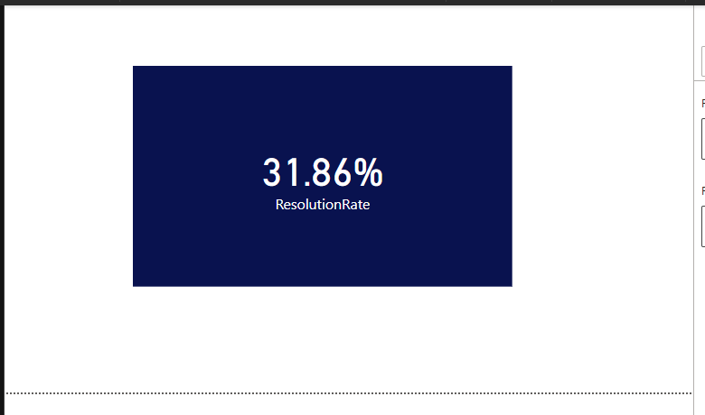

# 🕵️ Crime Record Analytics System

An interactive crime analytics dashboard built using **Supabase PostgreSQL** and **Power BI**, designed to visualize, analyze, and track crime data effectively.

## 📊 Project Overview

This dashboard helps identify crime patterns, monitor case statuses, and visualize geographic crime distribution. It's connected live to a PostgreSQL database hosted on **Supabase**, allowing future data expansion and updates.

## ⚙️ Tech Stack

- **Backend**: Supabase (PostgreSQL)
- **Visualization**: Power BI Desktop
- **Data Integration**: ODBC PostgreSQL Connector
- **Data Format**: CSV import with UUID keys

## 🧾 Tables Used

| Table             | Description                                      |
|------------------|--------------------------------------------------|
| `crime`          | Stores all crimes: type, date, status, location |
| `officer`        | Officers handling cases & their assigned areas   |
| `crime_assignment` | Maps officers to crimes via foreign keys         |

## 🔍 Key Features

- Bar chart showing crime type frequency
- Line chart showing crime trends over time
- Filled map with crime locations
- Cards showing open cases and total reports
- Officer-wise crime assignment visual
- Slicer filters (crime type, status, etc.)
- Clean and customizable color theme

#### 📊 Crime Analytics Dashboard – Preview

### 🔹 Dashboard Overview

### 🔹 Map Visual

### 🔹 Cards

## 🧠 Advanced Features

- UUID primary/foreign keys for relational integrity
- Auto-refresh capability
- Relationship model: One-to-Many joins
- Compatible with future data scale-up

## 📸 Screenshots

_Add screenshots of your dashboard here (optional)_

## 🚀 How to Run the Project

1. Clone or download the repo
2. Open `crime_dashboard.pbix` in Power BI Desktop
3. Connect ODBC to Supabase (PostgreSQL)
4. Click "Refresh" to sync updated data

## ✅ Status

✔️ Project Completed  
📂 Ready for portfolio, demos, or submission

## 📬 Contact

**Vidhi Baghel**  
LinkedIn / GitHub / Email (Add your links if you’d like)
